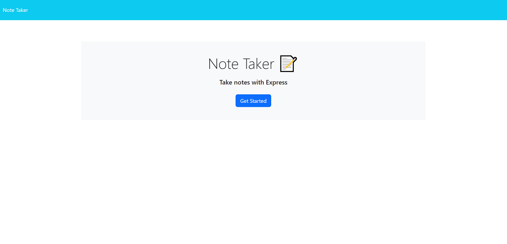
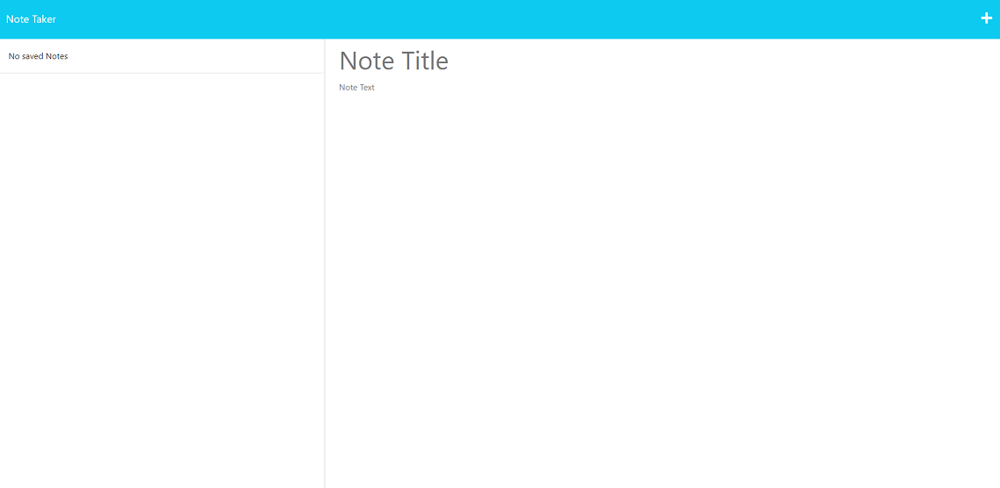
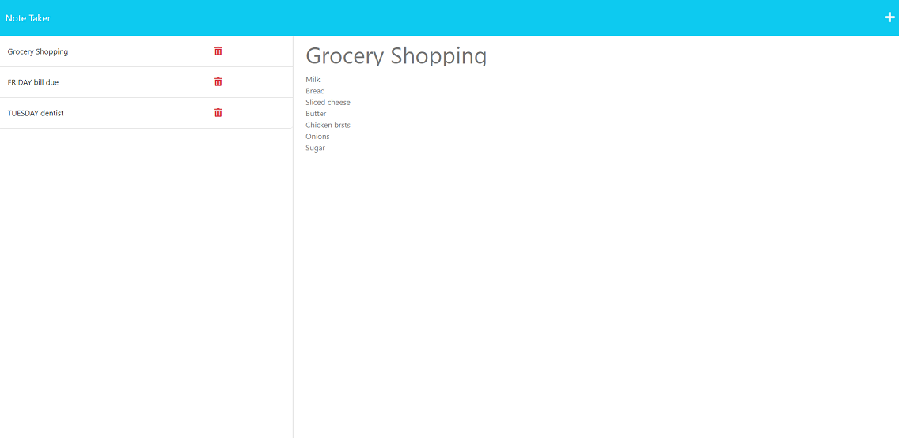

# **Express Note Taker**

### Welcome to Express Note Taker.  This application is a note taker using express for backend storage.  Activities or ideas needing to be notated, can be saved then viewed over again, until ready to delete the notation.  Even when the application is closed the data saved stays current until manual deletion occurs.  

### **Table of contents:**

- [Getting Started](#getting)
- [Usage](#usage)
- [Resources](#resources)
- [Location](#location)
- [License](#license)

## Getting Started:

First travel to [*this link*](https://express-html-note-taker.herokuapp.com/).

## Usage:
  
Click 'Note Taker' in the middle of the screen. Now you will see a link on the top left 'Note Taker'.  This will take you back to the first page.  Under that is a section that says 'No saved Notes'.  Just to the right is a section that says 'Note Title'.  Here you will enter the title of your activity or idea.  Under that says 'Note Text'.  Here you will write the full description of your activity or idea.  Once you have entered text into both fields, a save button icon will appear in the top right of the window.  Click that to save your input.  Once clicked it'll appear in the section previously displaying 'No saved Notes'.  Here you can click on the note when it turns grey to view in the same section you entered your title and text to create this note.  If you do not wish to delete this note by clicking the delete icon next to your saved title activity/idea, click the plus symbol in the top right of the screen to save another activity or idea.  

**Walkthrough video [*click here*](https://drive.google.com/file/d/19LdSwZsNTLatXhGA1vGY3TMIhLC-cj6x/view).**

## Resources:

 [*offical site*](https://nodejs.org)

 [*offical site*](https://expressjs.com/)

**_Original Source Code:_**&nbsp;&nbsp;[provided by UTexas.edu](https://techbootcamps.utexas.edu/coding/)

[Google search](https://www.google.com)

## Location:

GitHub Repo: [*click here*](https://github.com/zMag33z/week-11-Express_Note_Taker)

Heroku live: [*click here*](https://express-html-note-taker.herokuapp.com/)

## License:
  

  
See *Terms & Conditions* of the license [***here***](https://opensource.org/licenses/MIT).

 

#### [**Back to top**](#)